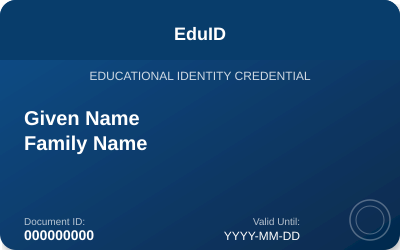

# eduID Credential

A verifiable credential for educational identity, based on PID ARF 1.8. Provides identity attributes for students and staff within the education and research sector.

## Claims

- `given_name` "Given Name" (string): Current first name(s), including middle name(s) if applicable [mandatory] [sd=always]
  - sv: "Förnamn" - Förnamn, inklusive mellannamn
  - de-DE: "Vorname" - Vorname(n), einschließlich zweiter Vorname
- `family_name` "Family Name" (string): Current last name(s) or surname(s) [mandatory] [sd=always]
  - sv: "Efternamn" - Aktuellt efternamn
  - de-DE: "Familienname" - Aktueller Familienname
- `birthdate` "Date of Birth" (date): Full birth date (day, month, year) [mandatory] [sd=always]
  - sv: "Födelsedatum" - Fullständigt födelsedatum
  - de-DE: "Geburtsdatum" - Vollständiges Geburtsdatum
- `place_of_birth` "Place of Birth" (object): Place where the person was born [mandatory] [sd=always]
- `place_of_birth.locality` "City of Birth" (string): Municipality, city, town, or village where the person was born [sd=always]
- `place_of_birth.region` "Region of Birth" (string): State, province, district, or local area where the person was born [sd=always]
- `place_of_birth.country` "Country of Birth" (string): Country where the person was born [sd=always]
- `nationalities` "Nationalities" (array): Country or countries of nationality [mandatory] [sd=always]
- `personal_administrative_number` "Personal ID" (string): Unique personal identifier assigned by the authority [sd=always]
- `picture` "Picture" (string): Portrait photo of the holder [sd=always]
- `birth_family_name` "Birth Last Name" (string): Last name(s) or surname(s) at birth [sd=always]
- `birth_given_name` "Birth First Name" (string): First name(s), including middle name(s), at birth [sd=always]
- `sex` "Sex" (string): Recorded sex or gender, using standard codes [sd=always]
- `email` "Email" (string): Person's email address [sd=always]
  - sv: "E-post" - Personens e-postadress
- `phone_number` "Mobile" (string): Person's mobile phone number [sd=always]
  - sv: "Mobilnummer" - Personens mobilnummer
- `address` "Address" (object): Person's residential address [sd=always]
- `address.formatted` "Full Address" (string): Full formatted address of residence [sd=always]
- `address.street_address` "Street" (string): Street name of residence [sd=always]
- `address.house_number` "House Number" (string): Street number of residence [sd=always]
- `address.postal_code` "Postal Code" (string): Postal or ZIP code of residence [sd=always]
- `address.locality` "City" (string): Municipality, city, town, or village of residence [sd=always]
- `address.region` "Region" (string): State, province, or regional division of residence [sd=always]
- `address.country` "Country" (string): Country where the person currently resides [sd=always]
- `age_equal_or_over` "Age Thresholds" (object): Age threshold indicators [sd=always]
- `age_equal_or_over.14` "Age >= 14" (boolean): Indicates if the person is 14 years old or older [sd=always]
- `age_equal_or_over.16` "Age >= 16" (boolean): Indicates if the person is 16 years old or older [sd=always]
- `age_equal_or_over.18` "Age >= 18" (boolean): Indicates if the person is 18 years old or older [sd=always]
- `age_equal_or_over.21` "Age >= 21" (boolean): Indicates if the person is 21 years old or older [sd=always]
- `age_equal_or_over.65` "Age >= 65" (boolean): Indicates if the person is 65 years old or older [sd=always]
- `age_in_years` "Age" (number): Person's age in completed years [sd=always]
- `age_birth_year` "Birth Year" (number): Year in which the person was born [sd=always]
- `issuing_authority` "Issuing Authority" (string): Name of the issuing body or Member State [mandatory] [sd=always]
  - sv: "Utfärdande myndighet" - Namn på utfärdande organ
- `issuing_country` "Issuing Country" (string): Member State where the document was issued [mandatory] [sd=always]
  - sv: "Utfärdande land" - Medlemsstat där dokumentet utfärdades
- `date_of_expiry` "Expiry Date" (date): End date of the document's validity [mandatory] [sd=never]
- `date_of_issuance` "Issue Date" (date): Start date of the document's validity [sd=always]
- `document_number` "Document Number" (string): Unique identifier of the eduID document [sd=always]
- `issuing_jurisdiction` "Issuing Region" (string): Regional or local subdivision that issued the document [sd=never]
- `trust_anchor` "Trust Anchor" (string): The trust anchor used to verify the document [sd=never]

## Images

